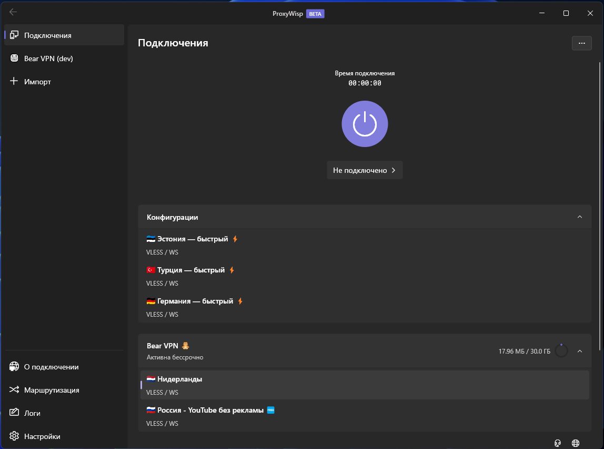
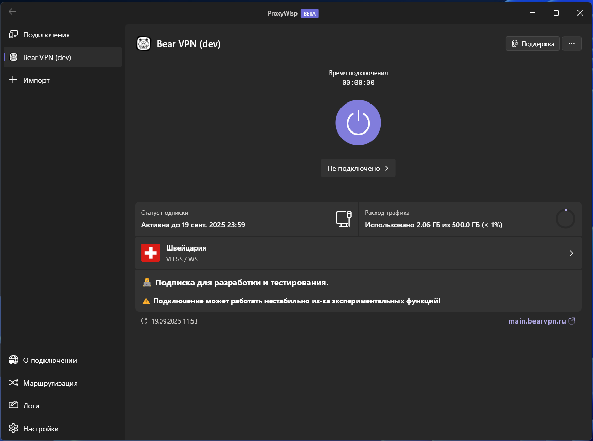
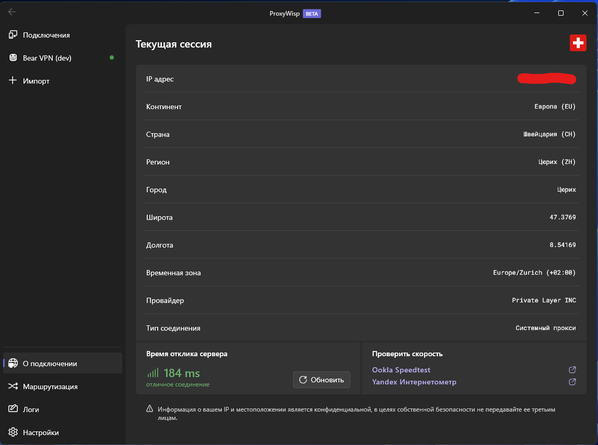
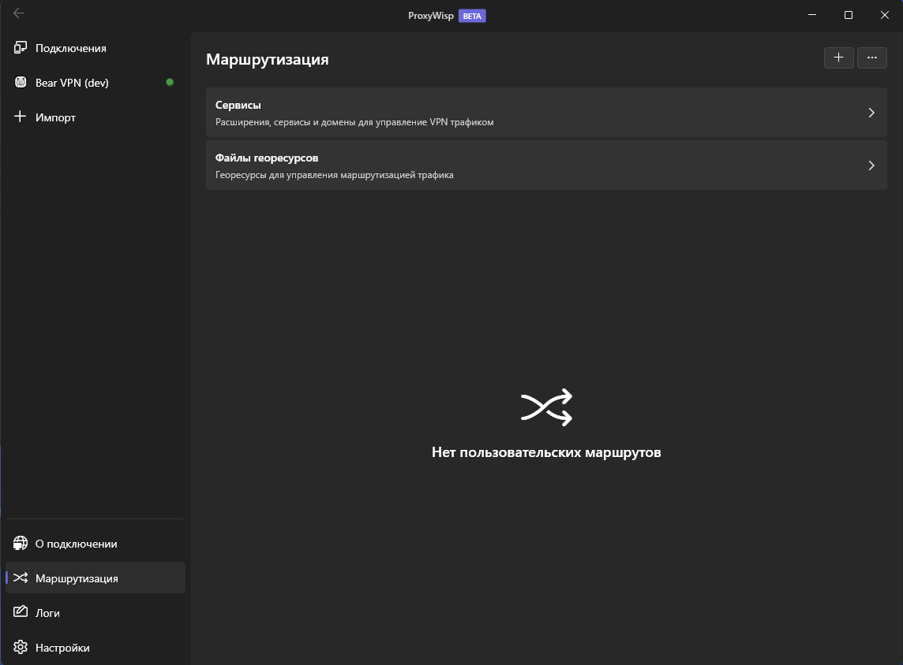
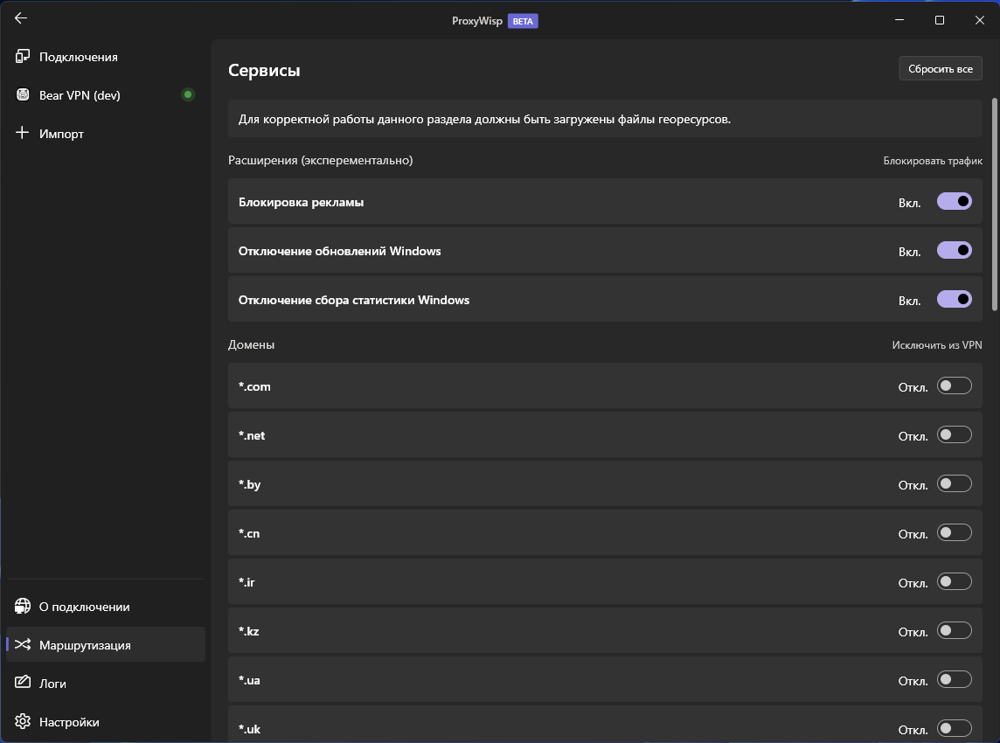
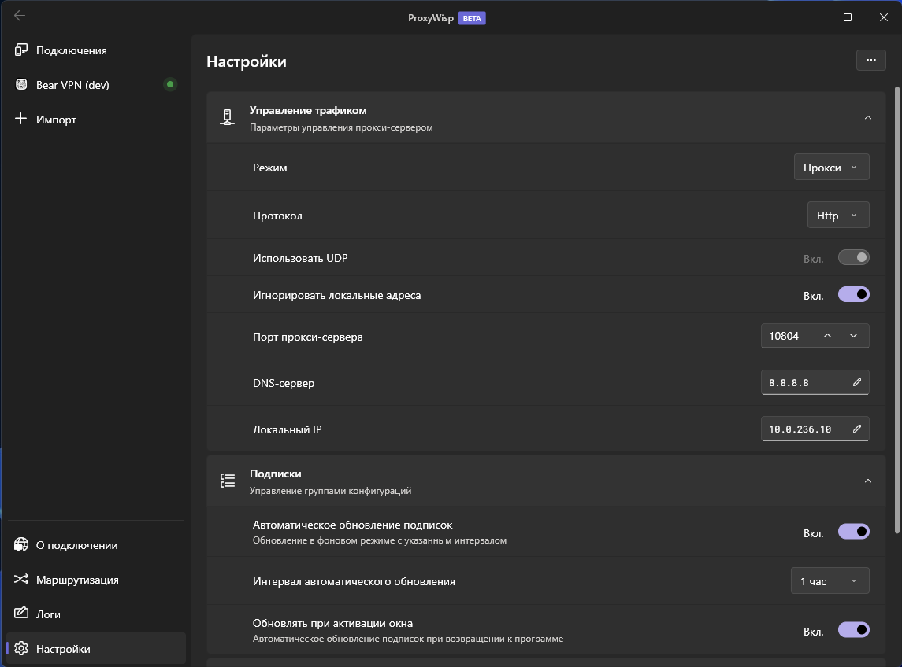

# ProxyWisp

**ProxyWisp** — это лёгкий и удобный VPN-клиент на базе ядра **Xray**, поддерживающий все его протоколы и форматы конфигураций.  
Приложение создано для простого и стабильного подключения к VPN с возможностью выбора способа работы (через системный прокси или tun2socks).

---

**⚡ Текущая версия — BETA: возможны ошибки, но вы можете помочь улучшить проект**

## ✨ Возможности

- 🔒 Поддержка всех протоколов Xray:
  - VLESS
  - VMess
  - Shadowsocks
  - Trojan
  - Socks
  - Hysteria
- 🌐 Режимы работы:
  - через системный прокси
  - через [sing-tun](https://sing-box.sagernet.org)
- ⚡ Простое и понятное управление подключениями
- 🗺 Поддержка кастомных параметров маршрутизации
- 🌟 Расширенные функции для провайдеров подписок
- 🖥️ Поддержка Windows (на данный момент)
- 🚀 В планах — версии для **Linux**, **macOS**, **Android** и **iOS**

---

## 📦 Установка

1. Скачайте последнюю версию ProxyWisp из [релизов](https://github.com/VanyaKrotov/ProxyWisp/releases).
2. Установите приложение запустив `ProxyWispSetup_vX.X.X.exe`.
3. Импортируйте конфигурации Xray или подписку.
4. Подключитесь к нужному серверу и пользуйтесь!

---

## 🛠️ Использование

- Добавляйте конфигурации вручную или импортируйте из ссылки.
- Управляйте профилями и переключайтесь между ними одним кликом.
- Выбирайте режим работы:
  - **Прокси** — для использования через системные настройки прокси.
  - **Туннель** — для полного туннелирования трафика.
- Конфигурируйте параметры под свои нужды в настройках.
- Настраивайте пользовательские маршруты или пользуйтесь нашими сервисами.

---

## 📷 Скриншоты

---

## 🌍 Дорожная карта

- [x] Клиент для Windows
- [ ] Поддержка macOS
- [ ] Поддержка Android (SmartTV)
- [ ] Поддержка iOS (Apple TV)
- [ ] Поддержка Linux

---

## 🤝 Вклад в проект

Используйте ProxyWisp и помогайте его развивать. Создавайте [issues](https://github.com/VanyaKrotov/ProxyWisp/issues) для багов и предложений. Вместе мы сделаем приложение лучше!

## 💖 Поддержите проект

ProxyWisp разрабатывается в свободное время и распространяется бесплатно.
Если вам нравится проект и вы хотите ускорить его развитие — вы можете поддержать нас донатом в криптовалюте.

Ваш вклад поможет:

- 🚀 Ускорить выпуск новых функций и платформ
- 🛠️ Улучшить стабильность и удобство приложения

Кошелёк для донатов:

- USDT (TRC20): `TFY8bmCWiwpWfvUknEFxPVEj8Mw4GR49d7`
- BTC: `1LMNeaEvzEE874MBp98V5C1rXcpBXYJBrD`
- ETH (ERC20): `0xdc8e5f647799687dfe562b40373a366eb5c64eba`

🙏 Спасибо каждому, кто поддерживает ProxyWisp!
